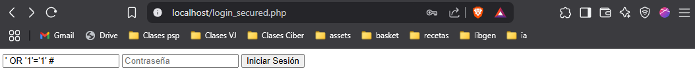
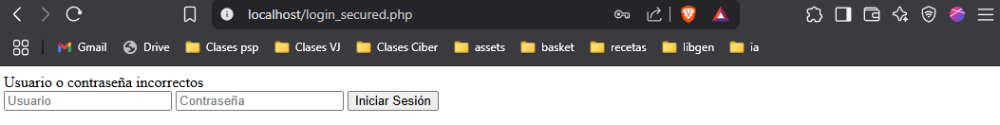

# Resolución tarea Módulo 2 
## Actividad 1 Explotación y Mitigación de SQL Injection (SQLi)

### Preparación del entorno

En lugar de instalar directamente apache y php en mi máquina he usado docker-compose.

### Sistema inseguro

Siguiendo los pasos establecidos en la actividad, comienzo creando el archivo `login.php`

Se ejecuta el comando: `docker-compose up`

Este comando crea los contenedores para la base de datos (mariadb) y el servidor apache con php. 

Se explota la inyección SQL:

### Asegurando el sistema

Siguiendo las instrucciones de la tarea se crea el archivo `login_secure.php`

Se prueba que no se puede explotar la inyección:

### Archivos utilizados

Todos los archivos de la tarea se encuentran en este repositorio para su revisión.

