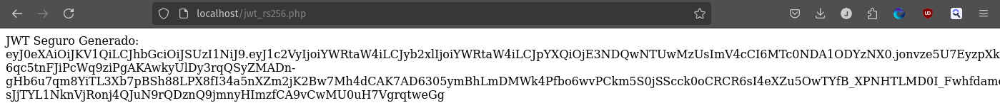
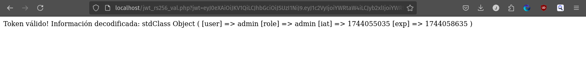
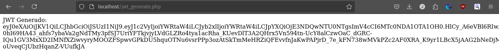
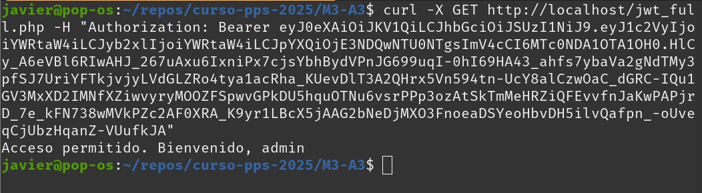

# Resolución tarea Módulo 3 
## Actividad 3 Manipulación de JWT y cómo protegerlo

### Preparación del entorno

En lugar de instalar directamente apache o composer en mi máquina he usado imágenes docker oficiales: `composer` y `php:apache`

Los comandos para crear los contenedores los he incluído en dos archivos: `composer-install.sh` y `server.sh`

### Sistema inseguro

Siguiendo los pasos establecidos en la actividad, comienzo creando el archivo `composer.json`

Se ejecuta el comando: `./composer-install.sh`

Este comando crea la carpeta `vendor` y los archivos de configuración de composer. 

Empezamos a crear los scripts siguiendo las intrucciones de la tarea (cambiando `secret` y modificando algo `jwt_decode.php`), con los siguientes resultados:

### Asegurando el sistema

Siguiendo las instrucciones de la tarea (creando una carpeta para las firmas y modificando los scripts para reflejarlo), se obtenien los siguientes resultados:

### Archivos utilizados

Todos los archivos de la tarea se encuentran en este repositorio para su revisión.

