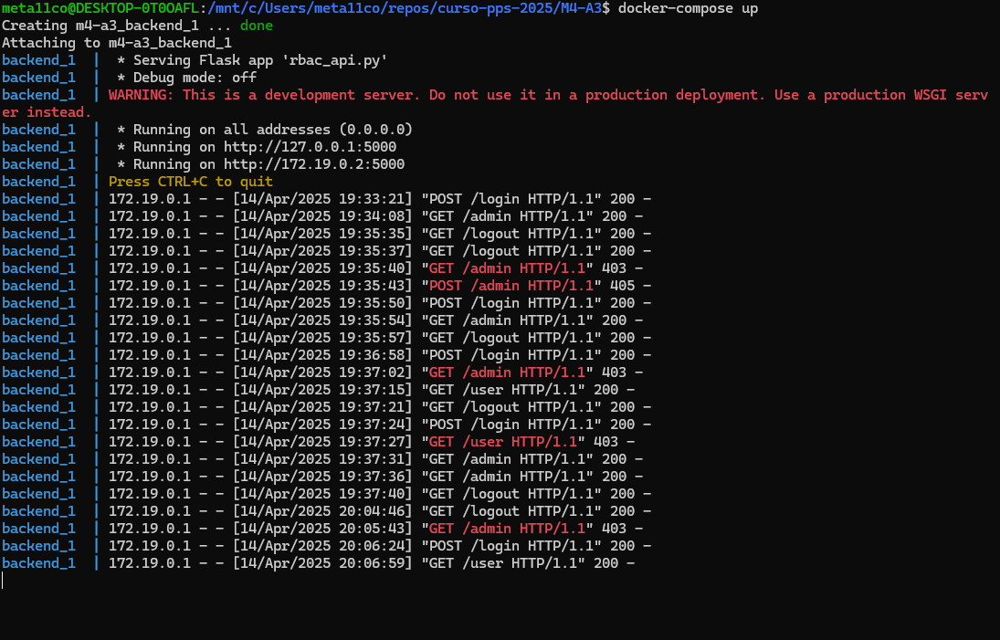
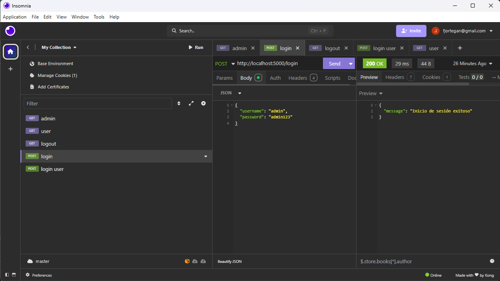
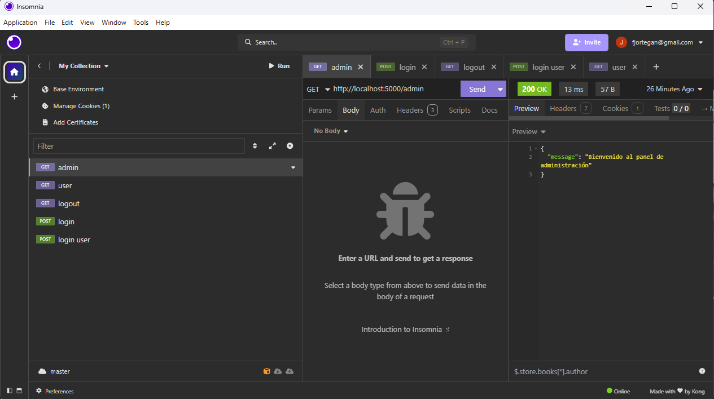
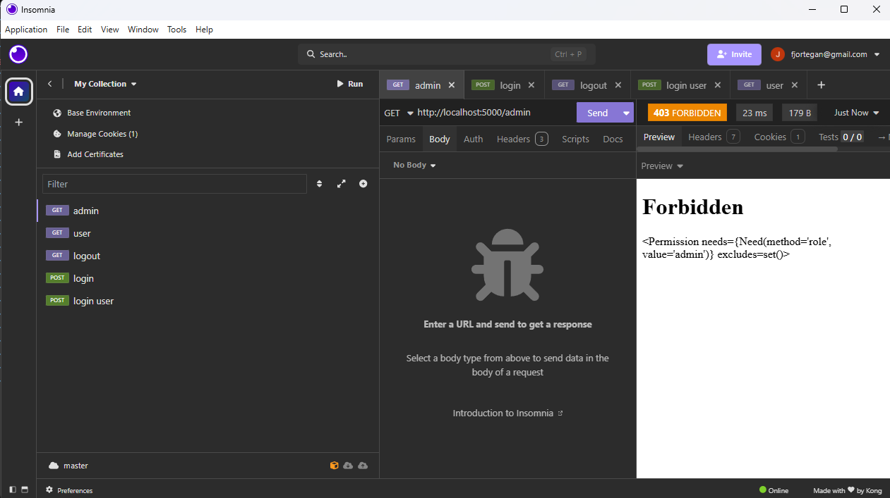
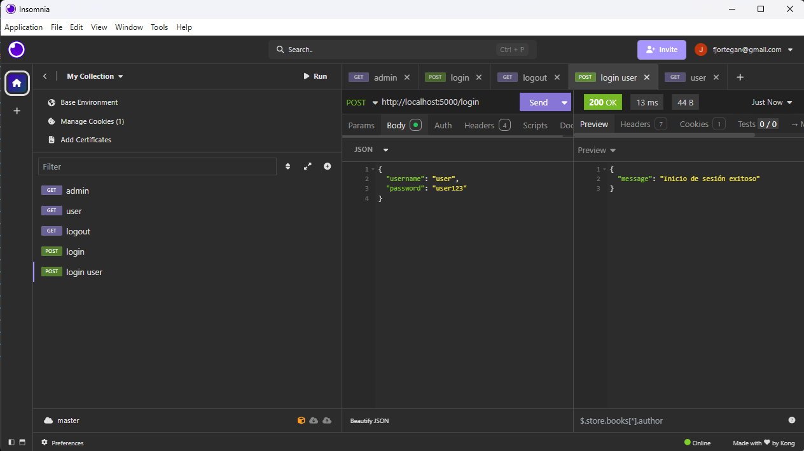
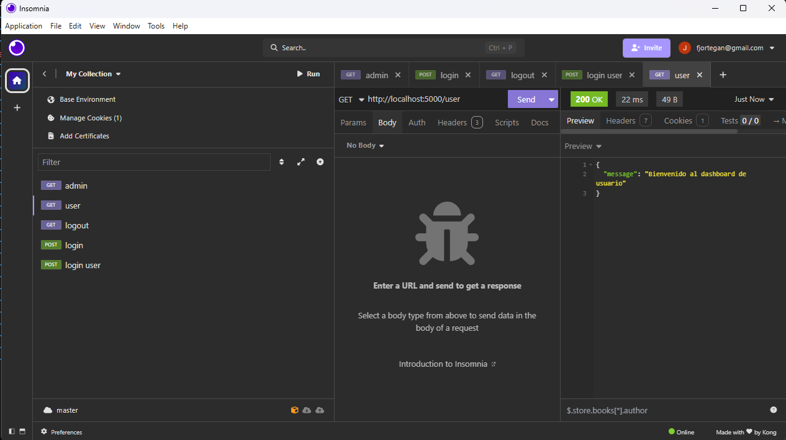

# Resolución tarea Módulo 4 
## Actividad 3 Implementación de Role-Based Access Control (RBAC)

### Preparación del entorno

En lugar de instalar directamente flask en mi máquina he usado docker-compose.

### Sistema

Siguiendo los pasos establecidos en la actividad, comienzo creando el archivo `rbac_api.py`

Se ejecuta el comando: `docker-compose up`

### Probando el sistema

Usando Insomnia REST para las peticiones al servidor:

### Archivos utilizados

Todos los archivos de la tarea se encuentran en este repositorio para su revisión.

