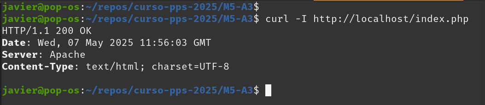

# Resolución tarea Módulo 5 
## Actividad 3 Identificación y Corrección de Security Misconfiguration

### Preparación del entorno

He usado docker-compose para poner en marcha el servidor apache con php.

### Identificación de la vulnerabilidad

Ejecutando el comando `curl -I http://localhost` (he publicado un archivo .php y otro .html):

### Corrigiendo la configuración

Se corrige la configuración de apache2:

Resultado una vez corregido el servidor apache2:

Se corrige la configuración de php:

Resultado una vez corregidos apache2 y php:

### Mitigación y mejores prácticas

Se ajusta el host virtual de apache2:

Resultado usando la nueva configuración:

### Archivos utilizados

Todos los archivos de la tarea se encuentran en este repositorio para su revisión.

