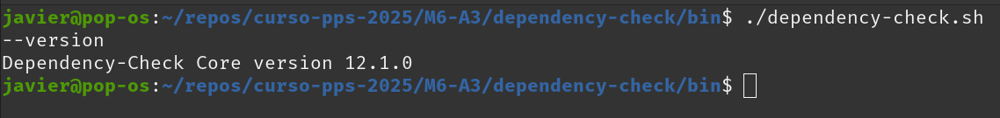
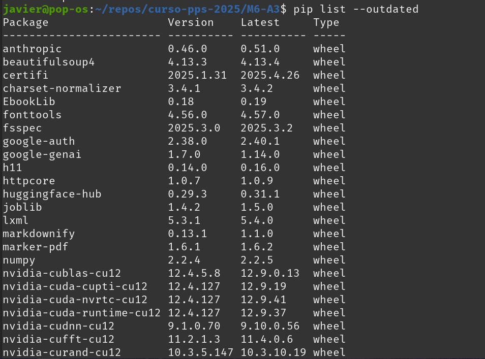
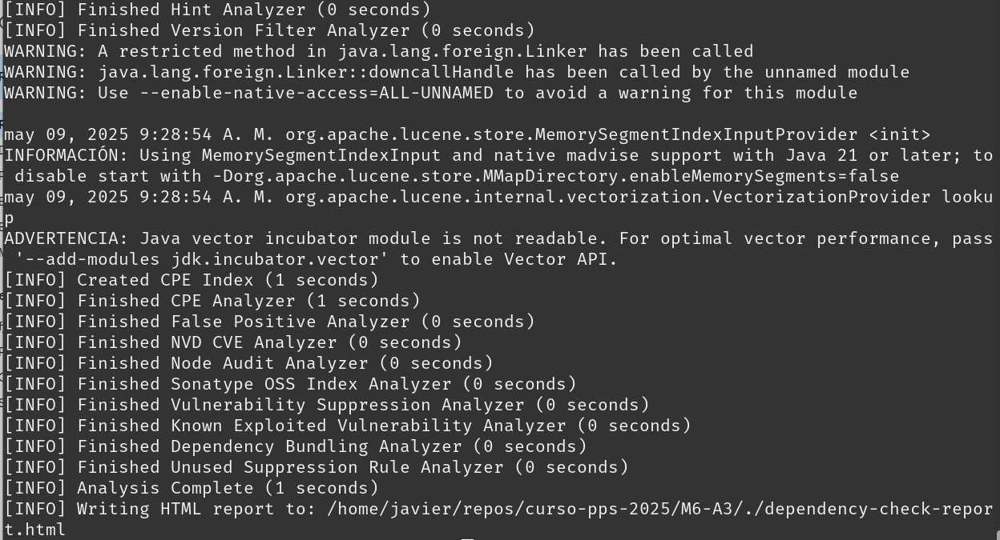
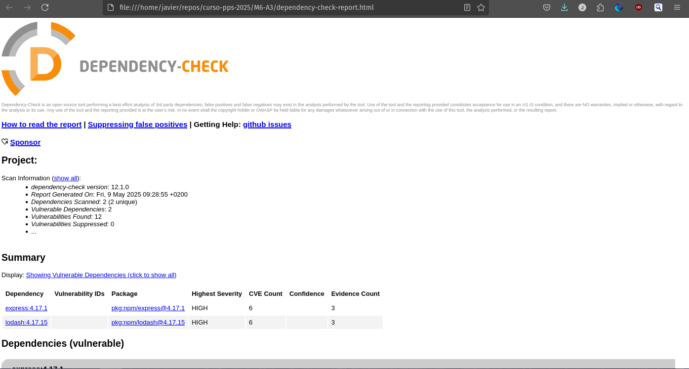

# Resolución tarea Módulo 6 
## Actividad 3 Análisis de Dependencias con Dependency-Check

Respecto a las instrucciones de la actividad solamente he complementado solicitando una clave API NVD para acelerar la descarga de datos de Dependency-Check.

Estos son los pantallazos de la ejecución en mi entorno:

